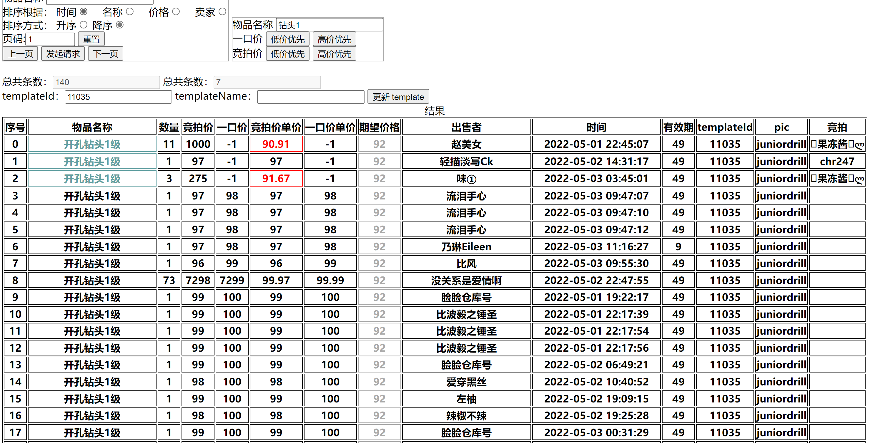

# 介绍
## 简介
这个是用 Java 写的弹弹堂拍卖场列表爬取、展示的工程。直接请求拍卖场接口，获取拍卖场数据，解析价格，展示于页面。
## 技术栈
后盾：基于 Spring Boot 3.0.0-M2 使用 Java 17 编写。数据库方面，使用 MySQL 并使用 MyBatis-plus 工具进行连接管理。

前端：简单的 HTML+JavaScript+CSS，没有使用其他框架；HTTP 请求使用 axios。
## 简单的静态页面
这个静态页面仅做展示用，没有后端的相关支撑，故无法返回相关请求。静态页面：[ddt.html](https://sleepybear1113.github.io/ddt-crawler/src/main/resources/static/ddt.html)


# 部署方式
## 本地 Jar 包部署：
1. 下载 Jar 包，[releases](https://github.com/sleepybear1113/ddt-crawler/releases)。
2. Java 所需版本为 Java 17。
3. 执行 `java -jar 文件名` 即可启动。
## IDEA 部署
1. 设置 Java 版本为 Java 17。
2. clone 代码并构建工程。
3. 启动工程。
## 数据库相关
在 `src/resources/application.yml` 文件中有定义的数据库地址，需要新建名为 `ddt` 的 schema。然后新建相关数据库，如下代码：
```sql
create table template
(
    id          bigint         not null primary key,
    name        varchar(255)   null,
    price       decimal(10, 2) null,
    modify_time bigint         null,
    constraint template_id_unique_index unique (id)
) engine = InnoDB;

create index template_name_index on template (name);
```
### 物品信息
由于拍卖场物品获取到的仅为物品 id，没有物品名称，需要在数据库中手动插入物品 id 和名称的对应关系，即 `template` 数据库的作用。此处不提供该数据。
# 使用方法
首先需要获取拍卖场的 HTTP 请求，可以在浏览器的控制台或者抓包获取。获取到 selfid 和 key 之后，填入页面对应位置，点击保存即可，而后就能进行物品的搜索。

其中 selfid 为用户 id，不会变，key 为每次登录随机生成，下线即失效，所以需要账号一直在线才能使用。搜索结果如下：


# 更新日志
## v0.2.2
- 【修】：copyProperties 数组异常
- 【修】：expireTime npe
## v0.2.1
- 【增】：添加 logback.xml 日志文件
- 【增】：引入自建缓存工具 cacher.jar，移除原本缓存工具
- 【改】：包名从 com.xjx 改为 cn.xiejx